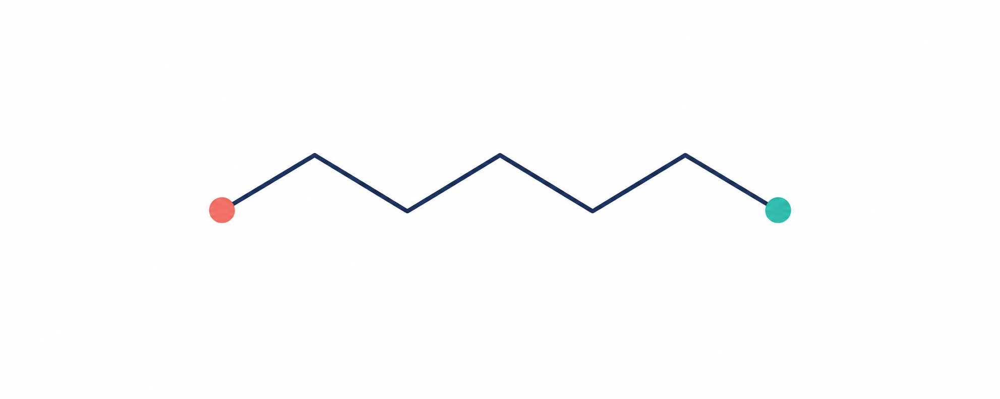

# Polymer Generator

A Python library for building 3D polymer structures with automatic retry/rollback logic, force field optimization, and export to multiple simulation formats (OpenMM, LAMMPS, GROMACS).

<p align="center">
  
</p>

## Features

- **Monomer Building**: Parse SMILES with connection points (`*`) and generate 3D coordinates
- **Polymerization**: Self-avoiding random walk with retry/rollback mechanism
- **Geometry Optimization**: MMFF94s or OpenFF with NAGL charges
- **Packing**: Pack multiple chains into periodic boxes using Packmol
- **Export**: Save to OpenMM XML, LAMMPS data files, GROMACS topology, PDB
- **Performance**: Numba-accelerated geometry calculations

## Installation

The recommended setup uses [micromamba](https://mamba.readthedocs.io/en/latest/user_guide/micromamba.html).
Install micromamba once, then run these commands from the repository root.

### Core package (RDKit and MMFF)

```bash
micromamba create -f environment.yml
micromamba activate polymer-generator
python -c "from polymer_lib import Monomer, Polymerizer; print('polymer_lib is ready')"
```

The environment file installs the project in editable mode, so code changes are immediately available without reinstalling.

### Install the package from GitHub

After replacing `<github-user>` and `<repository>` with the GitHub owner and repository name, users can install the latest version directly:

```bash
python -m pip install "git+https://github.com/<github-user>/<repository>.git"
```

For a clean environment with the required scientific dependencies, create the micromamba environment first, then install from GitHub instead of the local checkout:

```bash
micromamba create -n polymer-generator -c conda-forge python=3.11 pip rdkit numpy scipy numba tqdm
micromamba run -n polymer-generator python -m pip install "git+https://github.com/<github-user>/<repository>.git"
```

### Full environment (OpenFF, NAGL and Packmol)

```bash
micromamba create -f environment-openff.yml
micromamba activate polymer-generator-openff
python -c "from polymer_lib import Monomer, Polymerizer, OpenFFOptimizer; from polymer_lib.packer import PackmolPacker; print('full environment is ready')"
```

To use only the OpenFF optimizer from an existing core environment, install the optional Python extra with `python -m pip install -e ".[openff]"`; Packmol support is provided by the full environment.

Run the geometry and polymerization checks with `python -m pytest`.

## Quick Start
### Build a chain in one call

`build_polymer` handles monomer creation, repeat expansion, and polymerization. The result carries the molecule and run diagnostics.

```python
from polymer_lib import build_polymer

result = build_polymer('*CC(c1ccccc1)*', units=20, seed=7)
if not result.success:
    raise RuntimeError(result.failure_reason)

polymer = result.molecule
print(f"built in {result.elapsed_seconds:.1f}s; attempts={result.attempts}")
```

### Configure a build

Use `BuildConfig` to group geometric and retry settings. The default `dist_min=1.8` checks nonbonded heavy-atom contacts across the full current chain. Set `seed` to make both the initial monomer conformer and random growth rotations reproducible.

```python
from polymer_lib import BuildConfig, Polymerizer

polymerizer = Polymerizer.from_smiles(
    '*CC(c1ccccc1)*',
    count=20,
    config=BuildConfig(dist_min=1.8, retry=100, rollback=5),
    optimizer='mmff',
    optimizer_options={'max_iters': 1000},
    seed=7,
)
result = polymerizer.build()
if result.success:
    polymer = result.molecule
```

The advanced API still accepts a list of `Monomer` objects. `build()` now returns a `BuildResult`; use `build_mol()` if existing code needs the older molecule-or-`None` return value.

### Pack chains

For default packing settings, use the helper function:

```python
from polymer_lib.packer import pack_chains

topology = pack_chains(chains, density=0.3)
```

Use `PackmolPacker` directly when you need to configure retry count or tolerance.

## API Reference

This section documents the public entry points and their return values. Distances are in ångströms unless a parameter says otherwise.

### `build_polymer`

```python
build_polymer(smiles, units=None, *, target_atoms=None, tacticity='atactic',
              tacticity_center=None,
              optimizer='mmff', optimizer_options=None, config=None, seed=None)
```

Build a chain from one repeat-unit SMILES. The SMILES must contain exactly two `*` atoms for head and tail connection points. Specify either `units` (the repeat-unit count) or `target_atoms` (an approximate final atom count); target counts are rounded up to a whole number of repeat units.

| Argument | Meaning |
| --- | --- |
| `smiles` | Monomer SMILES with two `*` connection points. |
| `units` | Positive number of repeat units. |
| `target_atoms` | Approximate desired atom count in the output RDKit molecule, including explicit hydrogens. The repeat count is rounded up; actual count can exceed the target by up to one repeat unit's atom contribution. Specify instead of `units`. |
| `tacticity` | `'atactic'` (default), `'isotactic'`, `'syndiotactic'`, or a sequence such as `['+', '-']`. A sequence needs one entry per polymerization stereocenter. `+` preserves the selected atom's reference configuration; `-` inverts it. |
| `tacticity_center` | Optional atom index in the monomer that becomes the stereocenter at polymerization. Defaults to the atom next to the tail connection point. |
| `optimizer` | `'mmff'` by default; use `'openff'`, an optimizer object, or `None` to skip optimization. |
| `optimizer_options` | Keyword arguments for a named optimizer, e.g. `{'max_iters': 1000}`. Must be a dictionary and requires a string optimizer name. |
| `config` | Optional `BuildConfig` for geometry and retry settings. |
| `seed` | Integer seed for both the initial conformer and random growth rotations; RDKit accepts 0 through 2³¹−1. |

Returns `BuildResult`. Invalid SMILES, linkers, unit counts, or options raise exceptions. Exhausting retries returns a result with `success == False` and a `failure_reason`.

```python
from polymer_lib import build_polymer

result = build_polymer(
    '*CC(c1ccccc1)*', units=12,
    optimizer='mmff', optimizer_options={'max_iters': 1000}, seed=2026,
)
if result.success:
    polymer = result.molecule  # RDKit Mol with a 3D conformer
else:
    print(result.failure_reason)
```

Choose a standard tacticity with a string. `isotactic` repeats the local configuration, while `syndiotactic` alternates it:

```python
isotactic_chain = build_polymer(
    '*CC(c1ccccc1)*', units=20, tacticity='isotactic', seed=7,
)
syndiotactic_chain = build_polymer(
    '*CC(c1ccccc1)*', units=20, tacticity='syndiotactic', seed=7,
)
approximately_100_atoms = build_polymer(
    '*CC(c1ccccc1)*', target_atoms=100, tacticity='syndiotactic', seed=7,
)
```

To set each polymerization center individually, pass a sequence with one entry per inter-unit connection. `+` uses the selected atom's reference configuration; `-` inverts it. Lists, tuples, and NumPy arrays are accepted:

```python
from polymer_lib import build_polymer

custom_pattern = build_polymer(
    '*CC(c1ccccc1)*',
    units=4,
    tacticity=['+', '-', '+'],  # one sign for each of the 3 connections
    seed=7,
)
```

Ordered modes configure private monomer copies before embedding, then set the molecular stereochemistry from the generated 3D coordinates. `atactic` does not impose a pattern. Tacticity controls stereochemistry, independently of the torsion angles.

If the monomer has multiple stereocenters, choose the one that becomes stereogenic during polymerization by its atom index. The default selects the carbon next to the tail linker. Inspect it on `Monomer` or specify it directly:

```python
from polymer_lib import Monomer, Polymerizer

unit = Monomer('*C[C@H](F)C(c1ccccc1)*', seed=7)
print(unit.tacticity_center)
chain = Polymerizer(
    [unit.copy() for _ in range(20)],
    tacticity='syndiotactic',
    tacticity_center=unit.tacticity_center,
    seed=7,
).build()
```

The SMILES above also contains a separate stereocenter (`[C@H](F)`). The default tacticity center is next to the tail linker; the fluorinated center is left as specified in the input. For a different repeat direction, pass the intended atom index as `tacticity_center` to `Monomer`, `Polymerizer`, `BuildConfig`, or `build_polymer`.

The same options work through `BuildConfig`:

```python
from polymer_lib import BuildConfig, Monomer, build_polymer

smiles = '*C[C@H](F)C(c1ccccc1)*'
unit = Monomer(smiles, seed=7)
config = BuildConfig(
    tacticity='syndiotactic',
    tacticity_center=unit.tacticity_center,
)
chain = build_polymer(
    smiles, units=20, config=config, seed=7,
)
```

Set `optimizer=None` to assemble and validate coordinates without force-field minimization. This is faster, but it does not relax the geometry energetically.

### `BuildResult`

| Field | Type | Meaning |
| --- | --- | --- |
| `molecule` | RDKit `Mol` or `None` | Built chain with 3D coordinates, or `None` after retry exhaustion. |
| `success` | `bool` property | True when `molecule` is present. |
| `attempts` | `int` | Number of candidate connections tried across the run. |
| `rollbacks` | `int` | Number of rollback/restart events. |
| `elapsed_seconds` | `float` | Wall-clock build time. |
| `failure_reason` | `str` or `None` | Failure summary, or `None` on success. |

Pass `result.molecule`, not the `BuildResult` itself, to RDKit, OpenFF, or packing functions.

### `BuildConfig`

Every field is optional. These are the defaults:

| Field | Default | Meaning |
| --- | ---: | --- |
| `bond_length` | `1.5` | Target length of each new inter-unit bond. |
| `dihedral` | `π` radians | Target torsion when `random_rot=False`. |
| `random_rot` | `True` | Pick random torsions during growth. |
| `dist_min` | `1.8` | Minimum distance for nonbonded heavy-atom pairs; pairs within three covalent bonds are excluded. |
| `retry` | `100` | Additional full-chain retry/rollback cycles after the first attempt. |
| `rollback` | `5` | Successful growth steps to undo after a failed step. |
| `retry_step` | `200` | Candidate connections allowed at each step. |
| `check_bond_length` | `True` | Apply the built-in bond-length sanity check after each candidate. |
| `tacticity` | `'atactic'` | Backbone stereochemistry: `'atactic'`, `'isotactic'`, `'syndiotactic'`, or a `+`/`-` sequence. |
| `tacticity_center` | `None` | Monomer atom index for the polymerization stereocenter; defaults to the atom next to the tail linker. |

```python
from polymer_lib import BuildConfig, build_polymer

config = BuildConfig(
    bond_length=1.5, dihedral=3.141592653589793,
    random_rot=True, dist_min=1.8,
    retry=100, rollback=5, retry_step=200,
    check_bond_length=True,
)
result = build_polymer('*CC(c1ccccc1)*', units=12, config=config, seed=7)
```

When `config` is supplied to `Polymerizer`, its fields take precedence over individual geometry/retry keyword arguments.

### `Monomer`

```python
Monomer(smiles, seed=None, tacticity_center=None)
monomer.copy()
```

`Monomer` parses the SMILES, adds explicit hydrogens, generates an ETKDGv3 conformer, and validates that exactly two connection atoms are present. `seed` reproduces this conformer. `copy()` returns an independent molecule for a repeated-unit list.

```python
from polymer_lib import Monomer, Polymerizer

unit = Monomer('*CC(c1ccccc1)*', seed=7)
units = [unit.copy() for _ in range(12)]
result = Polymerizer(units, optimizer='mmff', seed=7).build()
```

For a prebuilt monomer list, `Polymerizer.seed` controls growth rotations but does not regenerate supplied coordinates in atactic mode. Ordered tacticity modes re-embed private copies of the monomers so the requested stereochemistry matches their 3D coordinates.

### `Polymerizer`

Use `Polymerizer` when repeat units differ, monomers are already constructed, or you need direct control of the build.

```python
Polymerizer(
    monomers, bond_length=1.5, dihedral=3.141592653589793,
    random_rot=True, dist_min=1.8, retry=100, rollback=5,
    retry_step=200, check_bond_length=True,
    optimizer=None, optimizer_options=None, config=None, seed=None,
    tacticity='atactic', tacticity_center=None,
)
```

`monomers` is a nonempty list of `Monomer` objects in chain order. The class defaults to `optimizer=None`; `build_polymer()` instead defaults to MMFF. `Polymerizer.from_smiles(smiles, count, **kwargs)` is a classmethod shortcut when every repeat unit uses the same SMILES. `build()` returns `BuildResult`; `build_mol()` returns the older RDKit `Mol`-or-`None` value for compatibility.

### Optimizers

- **MMFF94s:** `optimizer='mmff'`. Defaults: `max_iters=1000`, `variant='MMFF94s'`, `non_bonded_thresh=3.0 Å`. Example options: `optimizer_options={'max_iters': 1500, 'variant': 'MMFF94'}`. Nonconvergence rejects that candidate and invokes retry logic.
- **OpenFF:** `optimizer='openff'` or an `OpenFFOptimizer` object. Constructor defaults: `forcefield='openff-2.1.0.offxml'`, `max_iters=50`, platform `CPU`, tolerance `10.0 kJ/(mol·nm)`, and the installed default NAGL charge model. Install the full environment to use it.
- **None:** assemble and validate coordinates without energy minimization.

You can pass a configured optimizer instance instead of a string:

```python
from polymer_lib import MMFFOptimizer, Polymerizer

result = Polymerizer(monomers, optimizer=MMFFOptimizer(max_iters=1000)).build()
```

### Packing

`pack_chains(chains, density=0.3, max_attempts=5, tolerance=2.0)` is the convenience wrapper. It takes a nonempty list of RDKit molecules and returns an OpenFF `Topology` with periodic box vectors.

```python
from polymer_lib.packer import pack_chains

chains = [item.molecule for item in successful_results]
topology = pack_chains(chains, density=0.3)
```

For direct control, use `PackmolPacker(density=0.3, max_attempts=5, tolerance=2.0).pack(chains)`. Density is in g/mL; tolerance is in Å. Packing requires the OpenFF/Interchange/Packmol dependencies in the full environment.

### Test suite

From the repository root, activate the development environment and run:

```bash
micromamba activate polymer-generator
python -m pytest -q
```

The current tests cover connectivity, RDKit sanitization, bond-length bounds, the exact requested length of a new inter-unit bond, nonbonded heavy-atom distances for chains up to 20 units, mixed monomer sizes, seeded reproducibility, and MMFF optimization on a two-unit chain. The 20-unit check skips energy minimization; the MMFF test covers a short chain. These are structural regression checks, not a validation of polymer thermodynamics or application-specific simulation results.

### Advanced: build a single polymer chain
```python
from polymer_lib import Monomer, Polymerizer


smiles = '*CC(c1ccccc1)*'  # Polystyrene
monomer = Monomer(smiles)
monomers_array = [monomer.copy() for _ in range(20)]

polymerizer = Polymerizer(
    monomers=monomers_array,
    random_rot=True,
    dist_min=1.8,
    retry=100,
    rollback=5,
    retry_step=200,
    optimizer='mmff'  # or 'openff' for higher accuracy
)

result = polymerizer.build()
polymer = result.molecule if result.success else None
```
### 2. Pack Multiple Chains
```python
from polymer_lib.packer import PackmolPacker


chains = []
for i in range(5):
    monomers_array = [monomer.copy() for _ in range(20)]
    polymerizer = Polymerizer(
        monomers=monomers_array,
        optimizer='mmff'
    )
    result = polymerizer.build()
    if not result.success:
        raise RuntimeError(result.failure_reason)
    chains.append(result.molecule)

packer = PackmolPacker(
    density=0.3,        # g/cm³
    max_attempts=5,
    tolerance=2.0       # Å
)

topology = packer.pack(chains)
```

### 3. Create OpenMM System
```python
from openff.toolkit.typing.engines.smirnoff import ForceField
from openff.interchange import Interchange
import openmm


ff = ForceField("openff-2.1.0.offxml")
interchange = Interchange.from_smirnoff(
    force_field=ff,
    topology=topology
)


system = interchange.to_openmm_system()
topology_omm = interchange.to_openmm_topology()
positions = interchange.positions

interchange.to_pdb("system.pdb")

with open("system.xml", "w") as f:
    f.write(openmm.XmlSerializer.serialize(system))
```

### 4. Export to LAMMPS and GROMACS
```python
# LAMMPS
interchange.to_lammps(prefix="system", include_type_labels=True)
# Creates: system.lmp (data file)

# GROMACS
interchange.to_gromacs(prefix="system", monolithic=True)
# Creates: system.top, system.gro
```

## Architecture
```
polymer_lib/
├── __init__.py              # Main exports
├── calc.py                  # Geometry calculations (Numba-accelerated)
├── utils.py                 # RDKit utilities and logging
├── poly.py                  # Core polymerization logic
├── monomer.py               # Monomer class
├── polymerizer.py           # Polymerizer class
├── packer.py                # Packmol wrapper
└── optimizers/              # Structure optimizers
    ├── base.py              # BaseOptimizer ABC
    ├── mmff.py              # MMFF94s optimizer
    └── openff.py            # OpenFF + NAGL optimizer
```

## Optimizers
### MMFF94s (Fast)
```python
polymerizer = Polymerizer(
    monomers=monomers_array,
    optimizer='mmff'
)
```
### OpenFF with NAGL Charges (Accurate)
```python
from polymer_lib import OpenFFOptimizer

optimizer = OpenFFOptimizer(
    forcefield='openff-2.1.0.offxml',
    max_iters=1000,
    platform='CPU',
    charge_method='openff-gnn-am1bcc-1.0.0.pt'
)

polymerizer = Polymerizer(
    monomers=monomers_array,
    optimizer=optimizer
)
```
